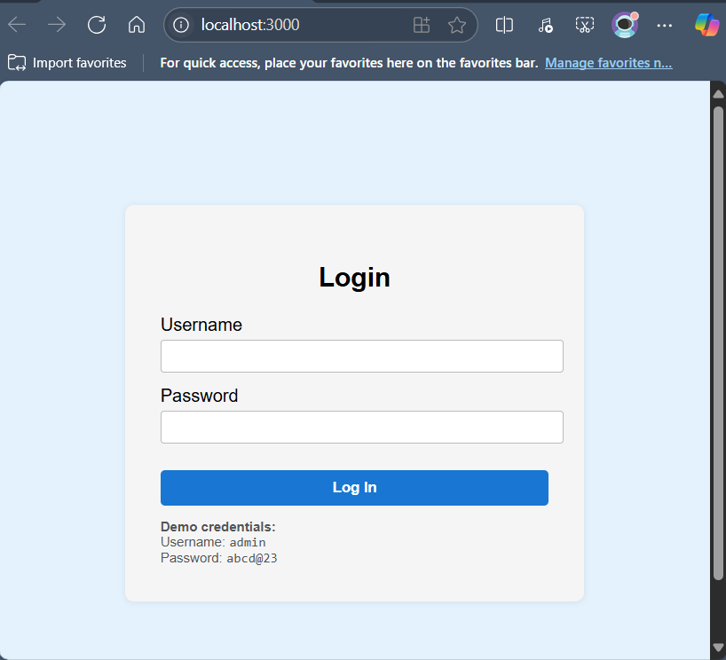
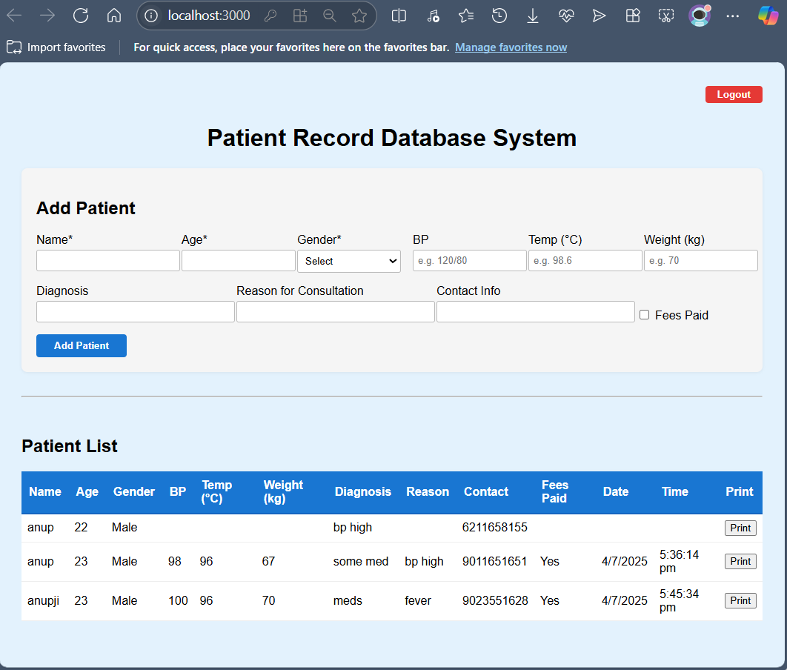

# Patient Record Database System

A simple React-based web app to securely add, view, and print patient records. Includes login for authorized access (nurse/doctor) and persistent data storage in the browser.

---

## Features

- **Login authentication** for nurses/doctors (default: `admin` / `abcd@23`)
- Add patient details including:
  - Name, Age, Gender
  - Blood Pressure (BP), Temperature, Weight
  - Diagnosis, Reason for Consultation
  - Contact Info, Fees Paid status
  - Date & Time of entry
- View all patient records in a sortable table
- Print individual patient details
- Data is saved in your browser (localStorage)
- Simple, clean, and responsive UI

---

## Screenshots

### Login Page
> Only authorized personnel (nurse or doctor) can access the system.



---

### Home: Add & View Patients



---

## How to Run

1. **Clone the repository**
    ```bash
    git clone https://github.com/your-username/Patient_Record_Database_System.git
    cd Patient_Record_Database_System
    ```

2. **Install dependencies**
    ```bash
    npm install
    ```

3. **Start the app**
    ```bash
    npm start
    ```
    The app will open at [http://localhost:3000](http://localhost:3000).

---

## Default Login

- **Username:** `admin`
- **Password:** `abcd@23`

---

## Usage

1. **Login** using the default credentials.
2. **Add patient** details in the form and click "Add Patient".
3. **View** all patient entries in the table below.
4. **Print** individual records using the "Print" button.
5. **Logout** when finished.

---

## Project Structure

```
src/
  ├── App.js
  ├── Login.js
  ├── PatientForm.js
  ├── PatientTable.js
  ├── index.js
  ├── index.css
```

---

## Notes

- All patient data is stored locally in your browser and will be lost if cleared.
- For multi-user or cloud features, consider extending with a backend and database.

---

# Just for learning and making project 